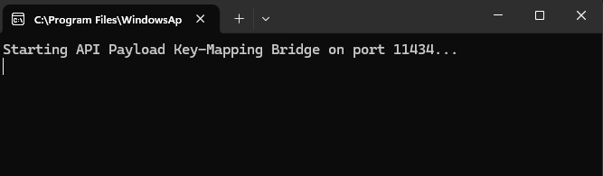
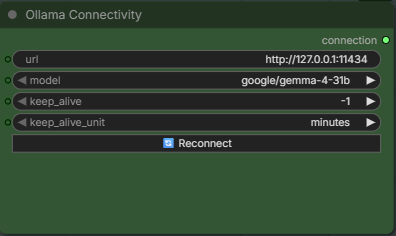

# Universal LM Studio to ComfyUI Ollama API Bridge

A lightweight, stateless Python utility that bridges the architectural gap between ComfyUI's Ollama node custom packs (e.g., `comfyui-ollama`) and LM Studio's local OpenAI/Anthropic compatible inference server. 

This bridge enables advanced, multi-stage structured text generation workflows to run flawlessly using high-performance local LLMs inside LM Studio without formatting failures, text truncation, or conversational hallucinations.

---

## 🔍 The Problem It Solves

When utilizing some advanced ComfyUI workflows, nodes may rely on a native Ollama backend to handle structured text parsing. When pointing these nodes directly to LM Studio, two major breaking points occur:

1. **Key-Mapping Discrepancy (System Prompts Drop):** ComfyUI sends hidden structural instructions using a top-level `"system"` key parameter. LM Studio expects system instructions packaged inside a `"messages"` array block as `{"role": "system"}`. Because of this mismatch, LM Studio drops the structural constraints completely.
2. **Conversational Bloat & Line Corruption:** Uncensored or highly creative models naturally output conversational preambles (e.g., *"Sure! Here is the sheet you requested..."*) or trailing commentary. This conversational noise completely breaks downstream ComfyUI string-slicing and text-parsing nodes that expect rigid, line-by-line machine formats.

### How This Bridge Fixes It Universally:
* **Dynamic Translation:** Actively intercepts the incoming JSON payload, extracts the `"system"` string block, and remaps it perfectly into a formal OpenAI-compliant structural message array.
* **Algorithmic Post-Cleaning:** Strips out stray leading whitespaces, newlines, and automatically trims off accidental conversational introductory text, aligning the raw output instantly with your target data anchors.
* **Stateless Isolation:** Emulates a clean vanilla Ollama container by building a fresh conversation context for every single execution queue request, preventing historical context bleed across successive prompt generations.

---

## 🛠️ Prerequisites

* **LM Studio** installed and running.
* **ComfyUI** with any Ollama API node extension pack (e.g., `comfyui-ollama`).
* **Python 3.x** installed on your host system (no external library dependencies required—uses built-in standard libraries).

---

## 📦 Setup & Installation

### 1. Prepare your LM Studio Server
1. Open **LM Studio** and navigate to the **Local Server** tab (the double-headed arrow/server icon on the left panel).
2. Select and load your preferred text-generation model (e.g., `Qwen`, `Llama`).
3. Under the **Server Settings** window on the right-hand side, ensure your server port is configured to `1234`.
4. Turn on **Serve on Local Network** and **Enable CORS** if required by your network layout.
5. Generate or locate your API Key under **Active API Keys**.

### 2. Configure the Script
Download or clone this repository, open `lm_studio_bridge.py` in your code editor, and update your configuration values at the top of the file:

```python
# ==================== CONFIGURATIONS ====================
OLLAMA_DEFAULT_PORT = 11434  # The local port ComfyUI will target
LM_STUDIO_URL = "http://127.0.0.1:1234"  # Your active LM Studio instance

# Paste your unique LM Studio API Token inside the quotes below
LM_API_TOKEN = "YOUR_LM_STUDIO_API_KEY_HERE" 
# ========================================================

```

### 3. Launch the Gateway

Open your terminal or command prompt, navigate to the directory containing the script, and execute:

```bash
python lm_studio_bridge.py

```

You will see a confirmation message:

`Starting API Payload Key-Mapping Bridge on port 11434...` Keep this terminal window running in the background.



---

## 🎨 ComfyUI Workflow Integration

To route your workflow strings seamlessly through the universal bridge:

1. Locate your text generation node inside your ComfyUI workspace.
2. Set the server connection URL parameter box precisely to:
```text
http://127.0.0.1:11434

```


3. Ensure your standard dynamic text prompts and system instruction boxes are wired up normally.
4. Click **Queue Prompt**. Your workspace nodes will now parse text blocks with 100% mechanical consistency.

---

## 📜 Script Source Code (`lm_studio_bridge.py`)

---

## 📄 License

This project is open-source and available under the [MIT License](https://www.google.com/search?q=MIT%LICENSE). Contributions to expand key-mappings for further external custom API frameworks are welcome!
